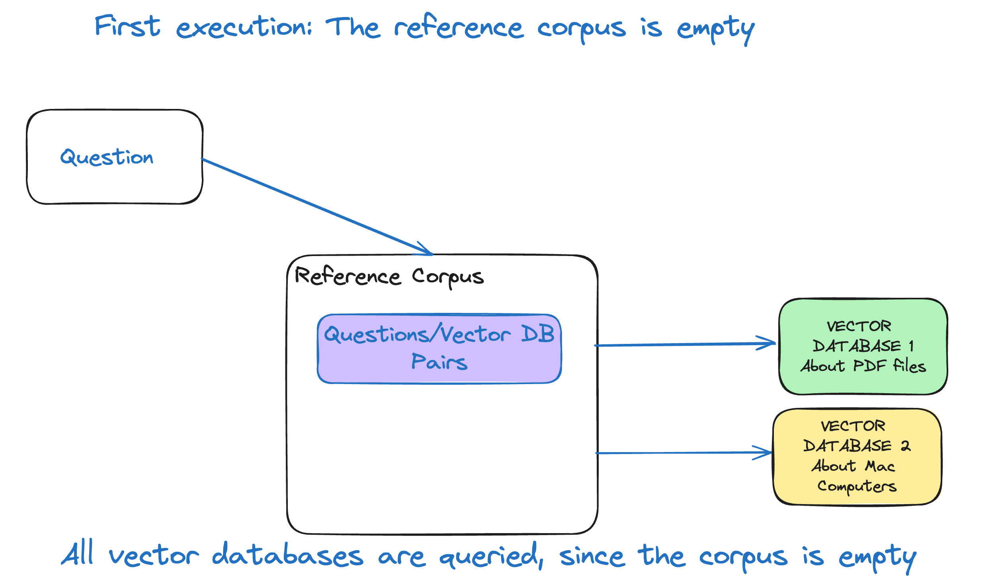
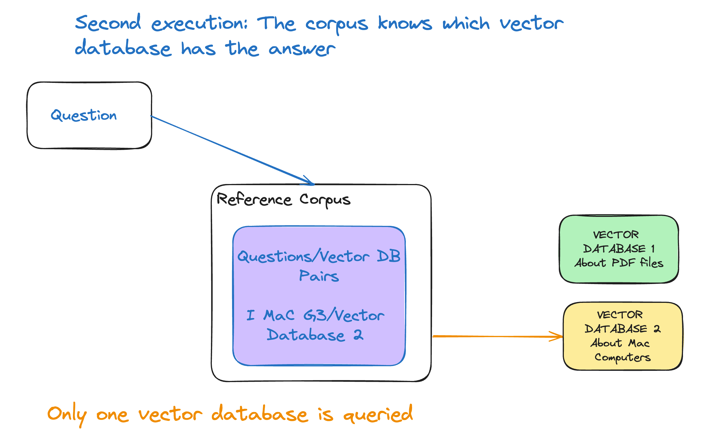

# Multiple Vector databases

I believe that most organizations will have multiple vector databases with their embeddings. When you want an answer, you may need to query them all. That can be expensive and time consuming. A reference corpus, which is another vector database with embeddings, can help.

## The vector databases
For this example we are using indexes in [Azure AI Search](https://azure.microsoft.com/en-us/products/ai-services/ai-search) to simulate vector databases. In the real world there would be many different technologies for the vector databases.
In the folter sample_docs there are two PDF documents: Mac.pdf contains the wiki of the History of Apple Mac computers.
pdf-sample.pdf contains a short definition of what PDF files are.
In the code we create two different indexes for each file:
```
# Let's create two indexes
process_file("../sample_docs/pdf-sample.pdf", "pdf-sample")
process_file("../sample_docs/Mac.pdf", "mac")
```
The name of the indexes are: pdf-sample and mac.

## How does it work

The first time you ask a question, you have to query all vector databases looking for an answer

After running that query, your reference corpus will be updated: The answer for question X, is in Vector store Y. This is will be also stored as an embedding.
This can be seen here from the logs:
```log
  -- Asking the reference corpus first -- 
    -- The corpus does not know which vector store has information about:  Describe characteristics of an iMac G3? -- 
    -- Querying all vector stores -- 
  -- All vector stores will be queried, now Querying vector store: pdf-sample
    --  Vector store pdf-sample does not have the answer for the question: Describe characteristics of an iMac G3?
All vector stores will be queried, now Querying vector store: mac
    -- The corpus has been updated: mac has knowledge about the answer for the question: Describe characteristics of an iMac G3? -- 
```
You can see that now the corpus "knows" that the answer for 'Describe characteristics of an iMac G3' is located in the Vector Database: mac

The next time you ask the same question, or something close to it:

The corpus will know where to find the answer and will only query that vector database that can be seen from the logs:
```log
-- Second iteration -- 
  -- Asking the reference corpus first -- 
    -- The corpus knows which vector store has information about:  Describe characteristics of an iMac G3? -- 
    -- Querying specific vector store: mac
The answer is: The iMac G3, introduced by Apple in 1998, was a significant product that helped .........
```

## What you need to run
You need the following Azure Services deployed, and their keys:
- AI Search
- Document Search
- OpenAI
  - Model text-embedding-ada-002 deployed
  - Model gpt-4-32k deployed (older may work not test)

## How to run
- Start github codespaces [Open in Codespaces](https://codespaces.new/MiguelElGallo/ragvectordb)
- Rename file sampleenv.txt to .env
  - Update the URLs and keys of your azure services
- Open the folder Notebooks, and there open Notebook corpus.ipynb
- On the upper right press "Select Kernel"
  - Choose Python enviroments
    - Choose Python 3.1xx.x
- Press the button "Run All"  

## Experimenting

After the first execution you are free to run the last cell of the Notebook that starts with:
```log
# Demo the a query with the corpus and without the corpus
```
You can change the question on that cell
```
query_with_corpus("Describe characteristics of an iMac G3?")
```

## If you run the whole notebook multiple times
There is not logic yet to drop or update the indexes, go to your Azure AI search and drop the indexes manually if you see erratic behaviour.


